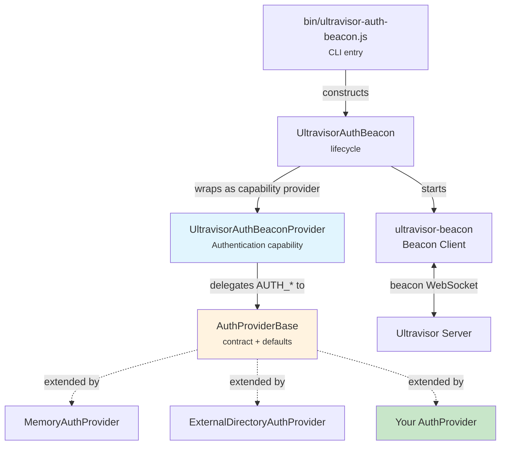
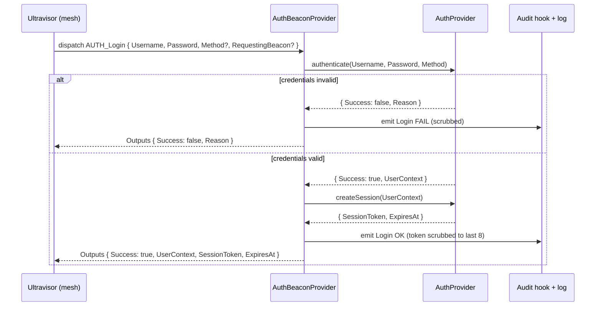

# Architecture

Ultravisor Auth Beacon is a thin, security-focused layer between an Ultravisor mesh and a pluggable identity backend. It connects to the Ultravisor server as a beacon, advertises one capability — `Authentication` — and translates each dispatched `AUTH_*` work item into a call on an `AuthProvider`.

This page describes the components, the request flows, the trust boundaries, and the documented limitations of the built-in providers. Because the component is security-sensitive, everything here reflects what the source actually does — no aspirational guarantees.

## Components

| Component | Source | Responsibility |
|-----------|--------|----------------|
| **UltravisorAuthBeacon** | `UltravisorAuthBeacon.cjs` | Boot/lifecycle. Builds the beacon-client config, wires the provider in as the sole capability provider, starts/stops the connection, computes registration `Tags`. |
| **UltravisorAuthBeaconProvider** | `UltravisorAuthBeacon-Provider.cjs` | The `Authentication` capability. Declares the `AUTH_*` actions and their schemas; `execute()` dispatches each to a handler that calls one `AuthProvider` method. Emits audit events and scrubs tokens. |
| **AuthProviderBase** | `providers/AuthProvider-Base.cjs` | The extension surface. Defines the method contract every provider implements; ships sensible defaults (e.g. `authorize()` allows any authenticated user; user management defaults to "not supported"). |
| **MemoryAuthProvider** | `providers/MemoryAuthProvider.cjs` | Built-in development provider. In-memory users + sessions, full user management, audit ring buffer, bootstrap-admin support. |
| **ExternalDirectoryAuthProvider** | `providers/ExternalDirectoryAuthProvider.cjs` | Built-in read-only provider simulating an external directory (LDAP/OIDC/IAM). Validates and mints sessions; all user CRUD disabled. |
| **server-routes** | `server-routes.cjs` | `mountUserManagementRoutes()` — a REST helper a host service mounts to expose `/Users` admin endpoints over orator-authentication. |
| **CLI** | `bin/ultravisor-auth-beacon.js` | Parses flags / config, resolves a provider (built-in short name, custom path, or default), constructs the beacon, handles graceful shutdown. |

The beacon class composes the provider, and the provider extends `ultravisor-beacon`'s `Ultravisor-Beacon-CapabilityProvider`. Two files instead of one because the boot sequence and the capability are independent concerns: a caller embedding the auth provider in-process can use the provider file directly without the full beacon machinery.



## No HTTP Server of Its Own

The beacon connects *out* to Ultravisor over the beacon transport (WebSocket, with HTTP polling fallback handled by `ultravisor-beacon`). It does **not** open an HTTP listener, and `defaultPort` is `0`. The Dockerfile reflects this: there is no `EXPOSE` and no `HEALTHCHECK` — compose/orchestrators treat the container as healthy while the process runs.

The `mountUserManagementRoutes()` helper *does* register HTTP routes, but those mount onto a **host** service's own Orator server (for example Ultravisor itself or a content host) — not onto a server inside this package.

## Registration and Tags

On `start()`, the beacon builds an `ultravisor-beacon` client config and registers. The capability provider is passed in the `Providers` array. The heartbeat interval is 30s (auth requests are small and chatty, so a long heartbeat is fine).

It advertises a `Tags` hash via `getRegistrationTags()`:

- `Role`: always `'auth'`
- `UserManagement`: `'internal'` if the provider's `supportsUserManagement()` returns `true`, else `'external'`

Ultravisor's status surface reads `UserManagement` to decide whether to show in-app user-administration views. Subclasses may override `getRegistrationTags()` to merge additional tags.

## Authentication Flows

### Login



`authenticate()` and `createSession()` are two separate provider calls: a provider can validate a credential without minting a session (and an authorization-only or token-introspection flow can skip the session step entirely).

### Session validation

`AUTH_ValidateSession` calls `validateSession(SessionToken)` and mirrors the provider's `{ Valid, UserContext?, ExpiresAt?, Reason? }` back as `Outputs`. The outcome is audit-logged (with the token scrubbed). The beacon notes that consumers using a cached validation path (orator-authentication caches for ~30s) will not generate an event on every call.

### Logout

`AUTH_Logout` calls `revokeSession(SessionToken)` and audit-logs the outcome.

### Authorization

`AUTH_AuthorizeAction` first resolves the session (`validateSession`), and only if the session is valid does it call `authorize(UserContext, Capability, Action)`. An invalid session short-circuits to `{ Allowed: false, Reason }`. The base-class default `authorize()` allows any authenticated user; providers override to layer on roles or capability-scoped allowlists.

## Beacon-Join Admission

In non-promiscuous mode, Ultravisor asks the auth beacon to vet *other* beacons before they join the mesh. `AUTH_ValidateBeaconJoin` calls `validateBeaconJoin(BeaconName, JoinSecret, Capabilities)` and returns `{ Allowed, Reason }`.

The base-class default is **deny** — a provider must explicitly opt in, either by checking a shared secret or by maintaining a per-beacon allowlist. Both built-in providers implement the shared-secret approach and compare the presented secret against their configured `BeaconJoinSecret` using `crypto.timingSafeEqual`, after a length check.

### Two separate secrets

There are deliberately two secret fields with related but distinct roles:

- **`JoinSecret`** (beacon config) — what *this* beacon presents to Ultravisor so it is allowed in. This is the bootstrap secret; per the base class, the auth beacon's own initial join uses the bootstrap secret in Ultravisor's config (chicken-and-egg), not `validateBeaconJoin()`.
- **`BeaconJoinSecret`** (provider config) — what the provider checks when *other* beacons ask to join.

The CLI and the embedded examples often set both to the same value for simplicity. In a more elaborate deployment they can differ — for example a per-beacon allowlist provider would ignore `JoinSecret` entirely and key off `BeaconName`.

## Bootstrap Admin

A fresh mesh has no users, but creating the first admin requires admin rights — a chicken-and-egg problem. `AUTH_BootstrapAdmin` resolves it. The provider is configured with a one-shot `BootstrapAdminToken`; a single successful `consumeBootstrapToken(Token, UserSpec)` call creates the first user (defaulting to the `admin` role) and then permanently disables the token. The token is compared in constant time, and it is **not** consumed on a failed create — the operator can retry with a different username; it burns only on the first successful admin creation.

`ExternalDirectoryAuthProvider` does not support bootstrap admin (the user store is owned elsewhere), and `AuthProviderBase` defaults it to "not supported."

## Audit Logging and Token Hygiene

Every `AUTH_Login`, `AUTH_ValidateSession`, and `AUTH_Logout` — success or failure — produces an audit event. The provider:

1. Stamps a `Timestamp` (ISO 8601) so all events share one clock source.
2. Structured-logs a one-line summary to `this.fable.log` (or `console`), including the originating beacon (`from beacon=<name>@<id>`) or `from direct caller`.
3. Calls the underlying provider's `onAuthEvent(pEvent)` hook.

Two safety properties hold here, both covered by tests:

- **Tokens are scrubbed.** `_scrubToken()` reduces any session token to its last 8 characters prefixed with an ellipsis before it appears in any event or log line, so a full token cannot leak via screen-share, error reporting, or copy-paste.
- **Audit failures never break auth.** If a provider's `onAuthEvent()` hook throws, the error is caught and warning-logged; the login (or other action) still completes.

The `RequestingBeacon` field — `{ Name, BeaconID, UserAgent? }` — is optional, informational attribution that propagates from the dispatched settings into the audit event. Tests confirm it survives the round trip into the provider's hook on both success and failure, and that its absence is fine (the event simply omits the field).

Both built-in providers implement `onAuthEvent()` as an in-memory ring buffer (default capacity 500) and expose `getRecentAuthEvents(pLimit)` (newest first, default 100) so operators and tests can inspect recent activity without standing up a real sink.

## HTTP Route Helper Details

`mountUserManagementRoutes(pServer, pOptions)` mounts user-administration routes on a host's Orator/Restify server. It is a shipping helper rather than routes baked into orator-authentication so that orator-authentication stays focused on sessions and credential checking, the auth beacon stays the single home of the `AUTH_*` contract, and each consumer mounts admin endpoints only when it wants them exposed.

Required options: `OratorAuth` (must expose `getSessionForRequest`) and `Dispatcher` (a function returning a Promise of the dispatch result). Optional: `RoutePrefix` (default `/1.0/`), `IsAdmin` (default: session has an `admin` role), and `Log`.

### Authorization model

Each admin route runs a guard: resolve the session via `getSessionForRequest`; if none, respond `401`; if `IsAdmin` is required and fails, respond `403`; otherwise run the handler. `/Me/ChangePassword` runs the session check only and always targets the session's own resolved UserID (from `UserRecord.IDUser` or `UserRecord.LoginID`). The `IsAdmin` function is the **only** authorization gate the helper applies — custom role schemes pass their own.

`DELETE /User/:UserID` additionally refuses (409) to delete the currently logged-in user: every other failure is recoverable via another admin, but locking yourself out of an empty mesh is not.

### Status code mapping

The helper maps the dispatcher's result shape to an HTTP status so a UI can branch on status without parsing JSON. It accepts both `{ Success, ... }` and `{ Outputs: { Success, ... } }`.

| Condition | Status |
|-----------|--------|
| `Success: true` | `200` (or `201` for create) |
| No session | `401` |
| Session but not admin | `403` |
| `Reason` matches `/unknown user/i` | `404` |
| Self-delete attempt | `409` |
| `Reason` matches `/not supported/i` | `501` |
| Other `Success: false` | `400` |
| Dispatcher rejected / threw | `502` |

`502` (not `500`) is used for a dispatch failure because the auth beacon being unreachable or throwing is distinct from the host service crashing.

## Trust Boundaries

- **The mesh dispatches; the provider decides.** The beacon does not define what a valid credential is, how long a session lives, or who may join. Those are the provider's responsibility. The beacon's job is the transport-to-provider translation, audit emission, and token hygiene.
- **User-management authorization lives at the edge.** The `AUTH_*User` actions perform the requested operation; they do not check who is calling. The supplied wiring (`mountUserManagementRoutes`) enforces session + role at the HTTP boundary before dispatching.
- **Secrets are configuration, not code.** `JoinSecret`, `BeaconJoinSecret`, and `BootstrapAdminToken` come from CLI flags, the JSON config file, or the embedding process. Keep them out of source control; the Docker image accepts secret-bearing values via the `<NAME>_FILE` convention (docker secrets / k8s Secrets).

## Built-in Provider Limitations

The built-in providers are honest about being development and test fixtures. Their own source headers call out:

- **Plaintext passwords.** Credentials are compared as plaintext and stored in cleartext. A production provider must use a real password hash (bcrypt / argon2 / scrypt).
- **In-process sessions.** Sessions live in a `Map`; restarting the beacon discards them. Expired sessions are swept lazily.
- **No rate limiting.** There is no brute-force protection on `authenticate()` — that is a provider concern, not the beacon's.
- **Single shared beacon-join secret.** Real deployments should issue per-beacon secrets and rotate them.

`MemoryAuthProvider` additionally defaults to **permissive** authentication: any non-empty username (and, in permissive mode, even an empty password) synthesizes an open-access, role-less `UserContext` so dev rigs "just work." Seeded users still require an exact password match. Set `Permissive: false` to require a seeded match for every login — and do so for anything that touches real data. In strict mode, an unknown username and a wrong password return the same `Invalid credentials` reason so the response does not reveal whether a username exists.

`MemoryAuthProvider.updateUser()` mutates an allow-list of fields (`Username`, `Roles`, `NameFirst`, `NameLast`, `FullName`, `Email`); `Password` and `UserID` are locked (password changes go through `setUserPassword` / `changePassword`). Self-service `changePassword()` revokes the user's other sessions ("change password ⇒ log out everywhere else"); admin `setUserPassword()` deliberately does not, so an admin-assisted reset doesn't force a re-login. Deleting a user also revokes that user's active sessions.

For production, write your own provider — see the [AuthProvider Guide](auth-provider.md).

## File Layout

```
ultravisor-auth-beacon/
	package.json
	bin/
		ultravisor-auth-beacon.js              # CLI entry point
	source/
		UltravisorAuthBeacon.cjs               # main class / lifecycle
		UltravisorAuthBeacon-Provider.cjs      # Authentication capability provider
		server-routes.cjs                      # mountUserManagementRoutes() helper
		providers/
			AuthProvider-Base.cjs              # provider contract + defaults
			MemoryAuthProvider.cjs             # dev provider (full user mgmt)
			ExternalDirectoryAuthProvider.cjs  # read-only directory simulation
	test/                                      # Mocha TDD tests
	docs/                                      # this documentation
	Dockerfile                                 # node:22-slim, no EXPOSE/HEALTHCHECK
```
